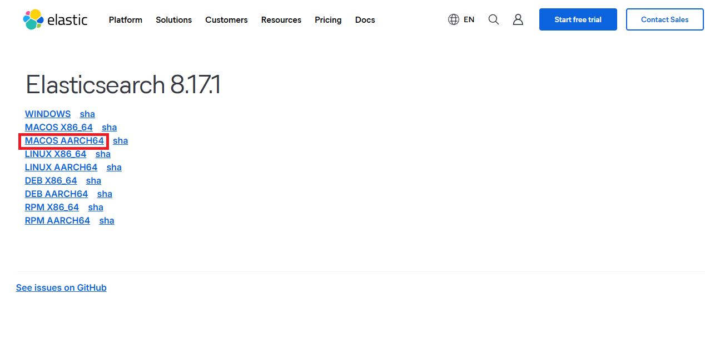
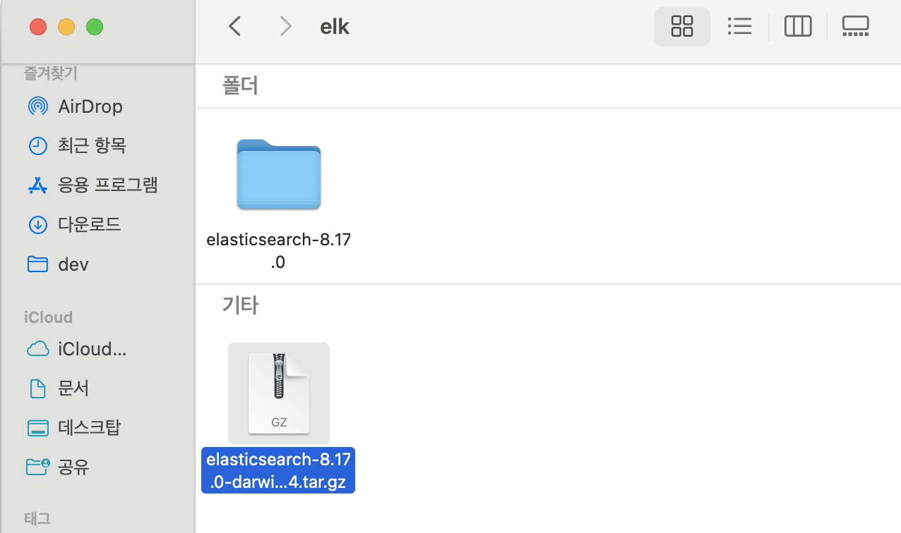

# \[ ELK 무작정 해보기 2 ] ElasticSearch설치하기 (8.17 버전) (Mac)

엘라스틱공식 홈페이지에서 다운로드

1. 아래 주소로 접속합니다.\
   [https://www.elastic.co/downloads/past-releases#elasticsearch](https://www.elastic.co/downloads/past-releases#elasticsearch)\

2.  원하는 버전을 선택 후 다운로드 버튼을 클릭합니다.

    저는 제일 최신 버전인 8.17.1 버전을 선택하도록 하겠습니다.

<figure><figcaption>
엘라스틱서치 다운로드 버전 선택
</figcaption></figure>

3. 다운로드 버튼을 클릭 후 알맞은 운영체제를 선택합니다.\
   저는 애플 실리콘 칩인 M1을 사용하고 있기 때문에 AARCH64를 선택하겠습니다.

<figure><figcaption>
엘라스틱서치 다운로드 운영체제 선택
</figcaption></figure>

4. 다운로드 받은 파일을 더블클릭해 압축을 풀어줍니다.

<figure><figcaption>
다운받은 tar파일 압축 풀기
</figcaption></figure>

5. 터미널로 접근하여 실행시키기
