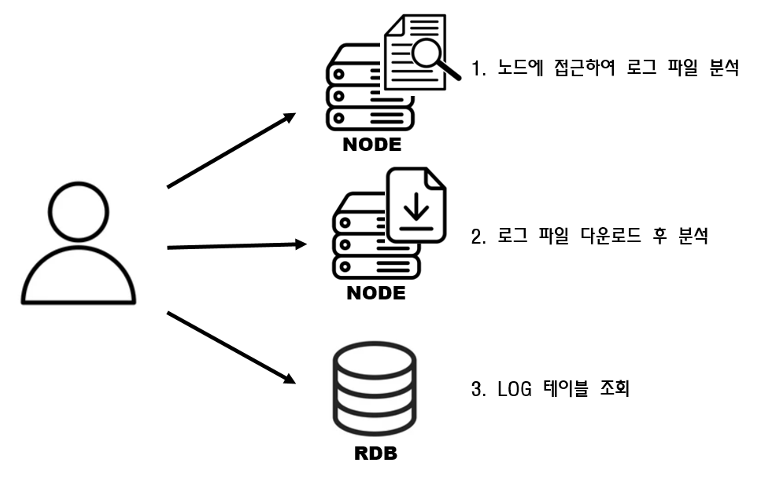

# \[ERROR] Apple에서 악성 소프트웨어가 있는지 확인할 수 없기 때문에 열 수 없습니다.(GateKeeper)

설치한 파일을 실행하려고 할때 GateKeeper에 의해 다음과 같은 에러가 발생할 때가 있다.

<figure><figcaption><p>Gatekeeper Error</p></figcaption></figure>


### GateKeeper가 뭘까?

<figure><figcaption><p>macOS GateKeeper</p></figcaption></figure>

그렇다고 합니다..\
한마디로 확인되지 않은 프로그램은 실행할 수 없게 차단하는 기능입니다.\
차단을 해제하는 방법은 크게 GateKeeper를 비활성화 하는방법과 해당 프로그램만 허용하는 방법이 있습니다.

### 1. GateKeeper 비활성화

1. 터미널을 열고 다음 명령어를 입력 후 관리자 계정 패스워드를 입력합니다.

```
sudo spctl --master-disable
```

2. 설정 -> 개인정보 -> 보안 메뉴의 모든 곳이 활성화 됩니다.\

3. 다음 명령어를 통해 다시 GateKeeper를활성화 해주도록 합시다.\
   명령어를 입력하면 보안 탭의 "모든 곳"이 사라진 것을 확인할 수 있습니다.

```
sudo spctl --master-enable
```

### 2. 해당 프로그램만 허용하기

설정 -> 개인정보 보호 및 보안 -> 그래도 열기를 해도 안됨.\
다운로드 된파일은 com.apple.quarantine 속성이 붙어 실행이 차단될 수 있음.\
아래 명령어에프로그램이 설치된 경로를 입력

```
sudo sudo xattr -r -d com.apple.quarantine /path/to/jdk <- (파일 경로)
```


