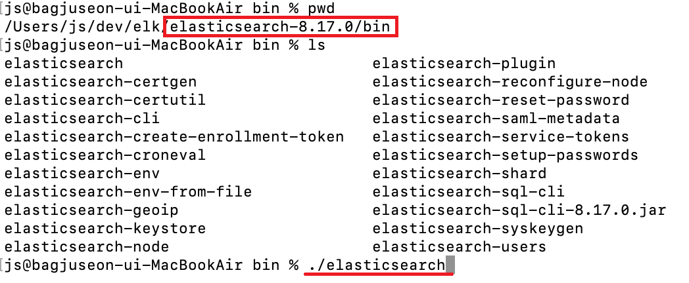

# \[ ELK 무작정 해보기 2 ] ElasticSearch설치하기 (8.17 버전) (Mac)

### 설치하기

***



아래 공식 홈페이지 주소로 접속합니다.\
[https://www.elastic.co/downloads/past-releases#elasticsearch](https://www.elastic.co/downloads/past-releases#elasticsearch)

\




원하는 버전을 선택 후 다운로드 버튼을 클릭합니다.\
저는 제일 최신 버전인 8.17 버전을 선택하도록 하겠습니다.

<figure><figcaption>
엘라스틱서치 다운로드 버전 선택
</figcaption></figure>

\




다운로드 버튼을 클릭 후 알맞은 운영체제를 선택합니다.\
저는 애플 실리콘 칩인 M1을 사용하고 있기 때문에 AARCH64를 선택하겠습니다.

<figure><figcaption>
엘라스틱서치 다운로드 운영체제 선택
</figcaption></figure>

\




다운로드 받은 파일을 더블클릭해 압축을 풀어줍니다.

<figure><figcaption>
다운받은 tar파일 압축 풀기
</figcaption></figure>



\

### 실행하기

***



터미널을 열고 elasticsearch-8.17.0/bin 경로의 elaticsearch 파일을 실행시킵니다.

<figure><figcaption>
elasticsearch 실행시키기
</figcaption></figure>

\


실행 시 다음과 같은 에러가 발생한다면 이 글을 참고해주세요.

[error-apple-..md](../../mac/error-apple-..md "mention")


<figure><figcaption>
macOS Gatekeeper
</figcaption></figure>

\




localhost:9200 으로 요청하여 정상적으로 실행 되었는지 확인합니다.\
(엘라스틱서치 기본 포트는 9200)\


최초 실행 후 localhost:9200로 접근하면 ID와 PW를 입력 해야 합니다. \
엘라스틱서치 실행 로그에서 아래와 같이 아이디와 초기 비밀번호를 확인할 수 있습니다.\
(id : elastic / pw : 7XHMwiELzoYy0Wk)


<figure><figcaption>
elasticsearch 실행 로그
</figcaption></figure>

\

Json으로 다음과 같은 내용이 출력된다면 정상 실행 된 것 입니다.

<figure><figcaption>
elasticsearch 정상 실행 확인
</figcaption></figure>

\



